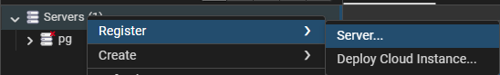
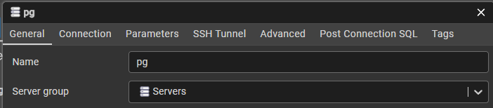
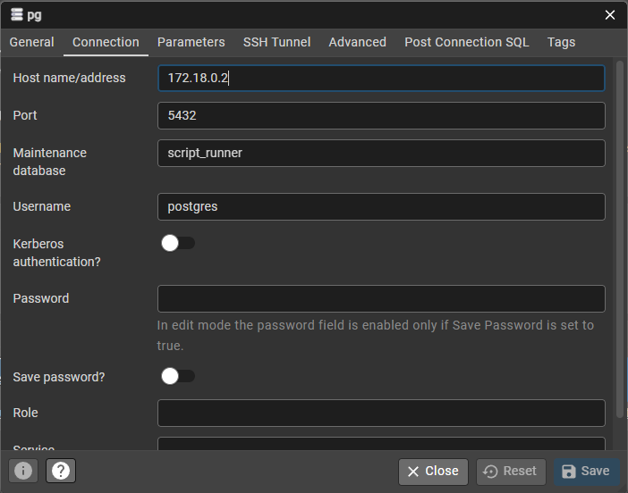

# Creating database containers

```
cd docker
docker compose up
```
# Accessing pgAdmin4

Open http://localhost:16543/login default user and password for local development 
email: script.runner@leonet.com.br
password: root

## Connecting to local server on pgAdmin4

Access register server


Give it a name


Configure local connection


```
host name/address: 172.18.0.2
port: 5432
database: script_runner
user: postgres
password: root
```